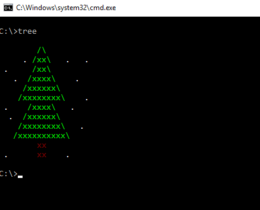
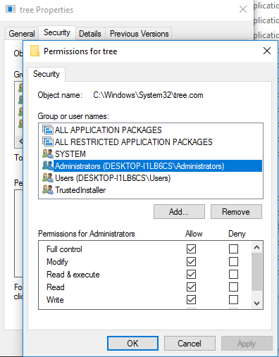

# Tree

A replacement for the DOS `tree` command. The output looks like this:

To install it, just copy the `tree.exe` file from the Release directory to `c:\` and
maybe to your user directory as well. On 64 bit Windows machines, use the `tree.exe`
from the `x64\Release`. This starts faster when started for the first time, because
it doesn't need to load the 32 bit subsystem. Using the 32 bit version on 64 bit machines
needs a few seconds when started first before it displays anything, but further starts
are fast.

# Advanced installing option

Instead of copying the program multiple times, you can also replace the original DOS
tree command. This is a bit more complicated, depending on your Windows version.
For Windows 10, right click on `c:\windows\system32\tree.com` and go to `Security`,
then click `Advanced`. Then click the `Change` link on top next to the owner. In then
dialog enter your user name in the text field and click `OK`. Now you can select in the
tree properties Window `Administrators`, click on `Edit` and then select on `Allow` for
`Full control`. It should look like this:

Then you can rename it, e.g. to `tree.old.com` or just delete it and then copy the new
`tree.exe` file to `c:\windows\system32`.

The program should work with any version, from Windows XP to Windows 10, but might not
work in Windows 98.
